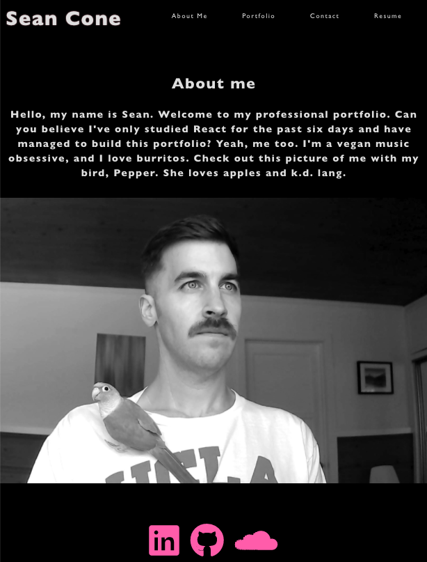

# React Portfolio 

Click the screenshot to link to the deployed application.

## Description

Welcome to the React Challenge: My React Portfolio! This is a deployed React portfolio of my work engineered to appeal to potential employers. Learn about me, check out my a curated array of my best work in boot camp, peek at my CV or contact me - It's all there. 

## License

This application is covered under the MIT license.

## Questions
Feel free to email me at seandoesitbetter@gmail.com with any questions.

Check out my GitHub profile: [seanc0ne](https://www.github.com/seanc0ne)

